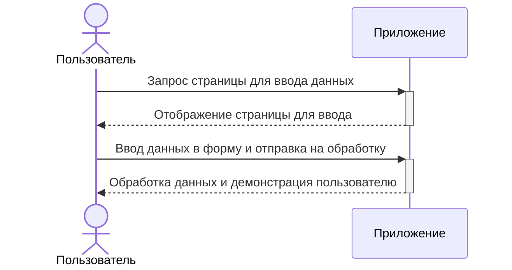

# README

Пример приложения на Rails 7 с реализацией асинхронной обработки формы при помощи Turbo.

Для валидации формы используется ActiveModel.

Тесты написаны с использованием RSpec и Capybara.

# Шаги выполнения

1. [Cоздание проекта](#создание-проекта)
2. [Установка RSpec](#создание-проекта)
3. [Создание контроллера](#создание-контроллера)
4. [Настройка машрутов](#настройка-маршрутов)
5. [Создание формы калькулятора](#создание-формы-калькулятора)
6. [Обработка полученных данных из формы в контроллере (без валидаций)](#обработка-полученных-данных-из-формы-в-контроллере-без-валидаций)
7. [Вывод результат асинхронно](#вывод-результата-асинхронно)
8. [Добавление проверок данных (валидаций) с помощью модели](#добавление-проверок-данных-валидаций-с-помощью-модели)
9. [Функциональные тесты контроллера и модели](#функциональные-тесты-контроллера-и-модели)
10. [Системные тесты с помощью RSpec + Capybara](#cистемные-тесты-с-помощью-rspec--capybara)
11. [Запуск проекта и тестов](#запуск-проекта-и-тестов)

## Создание проекта

[Посмотреть все правки этого шага](https://github.com/bauerone/rails_7_ajax_turbo/commit/d56e8ec8eb2a0543da5b160773b23817546887f5)

Для того чтобы создать проект была выполнена команда:

```console
rails new calculator -T
```

Опция ```-T``` была передана для того, чтобы генератор приложения не создавал проект с инструментами тестирования по умолчанию. В этом примере будет использоваться RSpec.

## Установка RSpec
[Посмотреть все правки этого шага](https://github.com/bauerone/rails_7_ajax_turbo/commit/aabf4058622f4f939bb74da2c622f8c6307f62ff)

Для того чтобы использовать фреймворк тестирования RSpec необходимо выполнить следующие шаги:

1. Добавить новую зависомость в Gemfile

	В группу :development, :test добавить следующую строку:
	
	```ruby
	gem 'rspec-rails', '~> 6.0', '>= 6.0.1'
	```

2. После этого необходимо установить новую зависимость в проект с помощью команды:

	```console
	bundle install
	```

3. Следующим шагом является интеграция RSpec в проект с помощью команды:

	```console
	rails g rspec:install
	```

После выполнениях вышеперечисленных шагов будет создана директория specs с конфигурационными файлами `spec_helper.rb` и `rails_helper.rb`, а также некоторые системные файлы. С этой точки rails-генераторы будут создавать именно rspec-тесты вместе с контроллерами, моделями и представлениями.

## Создание контроллера

[Посмотреть все правки этого шага](https://github.com/bauerone/rails_7_ajax_turbo/commit/833d0400946412fe6810183a064cb9385c2e2e26)

На этом шаге можно приступить к реализации логики проекта. На этом шаге необходимо создать контроллер для калькулятора. Изначально мы закладываем следующий сценарий:



На диаграмме последовательностей видно, что приложение должно обработать два разных действия: отображение страницы ввода и обработка данных с выводом пользователю. Из этого можно сделать вывод, что нужно создать контроллер, который будет обеспечивать эти два действия.

Для этого необходимо выполнить следующую команду:

```console
rails g controller Calculator input show
```

Аргументы вышеприведенной команды означают следующее:
* `rails g controller` - создать контроллер.
* `Calculator` - назвать контроллер "Calculator".
	
	Он будет создан в директории `app/controllers` с именем файла `calculator_controller.rb`.
	
	Также будет создан вспомогательный модуль `calculator_helper.rb` в директории `app/helpers`.
* `input show` - создать два экшна `input` и `show`.
	
	Вместе с двумя методами в самом контроллере будут созданы два представления `index.html.erb` и `show.html.erb` в папке `app/views/calculator`.
	
	ВНИМАНИЕ!!! По умолчанию эти аргументы также создадут два маршрута в файле `routes.rb`, использующие HTTP-метод GET.

Поскольку в предыдущем шаге был настроен RSpec - автоматически будут созданы соответствующие файлы тестов в директории `specs`.

## Настройка маршрутов

[Посмотреть все правки этого шага](https://github.com/bauerone/rails_7_ajax_turbo/commit/4bbcccf0e90768146e20d84fe6b093a39fde7a68)

После создания контроллера рекомендуется сразу настроить маршруты в файле `routes.rb`.

* Установка корневой страницы
	
	Рекомендуется сразу установить корневую страницу, которая будет отображаться при переходе на хост приложения (`/`)

	Для текущего примера в такой роли можно использовать страницу ввода данных. Необходимо явно назначить такой маршрут:
	
	```ruby
	root 'calculator#input'
	```

* Переназначение машрута для вывода результата

	По умолчанию подтверждение веб-форм использует HTTP-метод POST для отправки данных. На странице input будет находиться именна такая форма, которая будет отправлять введенные пользователем данные. Поэтому необходимо подготовить соответствующий маршрут, который будет ожидать запрос через метод POST:

	```ruby
	post '/сalculator/result'
	```

	Иногда маршруты могут становиться очень длинными и с ними не удобно работать. В таком случае машруты можно переименовать.

	Переименовать маршрут вывода результата для cтраницы вывода можно так:
	
	```ruby
	post '/result', to: 'calculator#result'
	```

	Пример выше можно интерпретировать так: в случае входящего POST-запроса по адресу `/result` перейти в контролер с именем `Calculator` и вызвать метод `result`.

ПРИМЕЧАНИЕ:

Получившиеся маршруты можно посмотреть с помощью команды `rails routes`. Данная команда выведет все имеющиеся маршруты в проекте.

Можно подробно вывести машруты для конкретного контроллера (например для Calculator):

```console
rails routes -c calculator --expanded
```

## Создание формы калькулятора

[Посмотреть все правки этого шага](https://github.com/bauerone/rails_7_ajax_turbo/commit/3c0c47be1a62cf14d8c3e61dd3de3d3d0b9c9cc4)

Так как в предыдущем пункте экшн `input` контроллера `Calculator` был установлен в виде стартового по умолчанию, то верстку формы калькулятора следует поместить в шаблон `input.html.erb`, который находится в директории `app/views/calculator`.

В процессе верстки использовались вспомогательные методы Rails:
* `form_with` - метод создания формы
* `label` - текстовая метка
* `number_field` - поле для ввода чисел
* `radio_button` - кнопка-переключатель
* `submit` - кнопка подтверждения формы

Содержимое `input.html.erb`:
```
<h1>Калькулятор</h1>

<h3>Введите значения и выберите математическую операцию</h3>

<%= form_with url: result_path do |form| %>
  <%= form.label('Значение x:') %>
  <%= form.number_field(:x) %><br/>
  <%= form.label('Значение y:') %>
  <%= form.number_field(:y) %><br/>

  <table>
	<% ['+', '-', '*', '/'].each do |operation| %>
	  <tr>
	    <td><%= form.label(operation) %></td>
	    <td><%= form.radio_button(:operation, operation, id: "operation_#{operation}") %></td>
      </tr>
	<% end %>
  </table>

  <%= form.submit('Посчитать', id: 'calculate-btn') %>
<% end %>
```

ПРИМЕЧАНИЕ:

Веб-формы по умолчанию используют HTTP-метод `POST`, поэтому запись `form_with url: result_path` приведет к созданию html-кода следующего вида:

```html
<form action="/result" accept-charset="UTF-8" method="post">
```

Для понимания принципов преобразования Rails-шаблонов в HTML рекомендуется посмотреть итоговую разметку в браузере.

## Обработка полученных данных из формы в контроллере (без валидаций)

[Посмотреть все правки этого шага](https://github.com/bauerone/rails_7_ajax_turbo/commit/6db2f3501b1c46ca8708d8172ca3819f5a40725e)

Созданная на шаге 5 форма делает POST-запрос в путь `/result`. Этот маршрут ведет в метод `result` контроллера `Calculator`. Это было прописано в файле `routes.rb` на шаге 4: `post '/result', to: 'calculator#result'`.

В форме располагаются три поля ввода:
* `number_field(:x)` - означает, что форма отправит на сервер параметр `x = значение поля`
* `number_field(:y)` - означает, что форма отправит на сервер параметр `y = значение поля`
* `radio_button(:operation)` - означает, что форма отправит на сервер параметр `operation = значение выбранного переключателя`

Таким образом можно сделать вывод, что в метод `result` будут отправлены три параметра: `x`, `y` и `operation`.
Чтобы получить к ним доступ в контроллере, надо вызвать метод `params`.

Например, если необходимо получить значение, которые было введено в поле `x`:
```ruby
@x_value = params[:x]
```

Содержимое params по сути является хешом, где все ключи являются именами аргументов в символьной записи (например значение параметра `'operation'` можно получить так: `params[:operation]`)

В текущем примере метод `result` должен получать значения `x` и `y`, а потом выполнять над ними математическую операцию (`operation`).

Для этого метод `result` контроллера `Сalculator` нужно доработать следующим образом:

```ruby
def result
  x_value = params[:x].to_f # достаем значение x и приводим его к числу
  y_value = params[:y].to_f # достаем значение y и приводим его к числу
  @result = x_value.send(params[:operation], y_value) # считаем результат
end
```

Сначала входящие параметры `x` и `y` надо привести к числовому типу (по умолчанию все параметры всегда приходят в виде строк).
После этого можно посчитать результат с помощью метода `send`.
	
Данный метод позволяет вызвать функцию от объекта, передав ее в виде строки:

```ruby
'hello'.upcase # => 'HELLO'
'hello'.send('upcase') # => 'HELLO'

2 + 3 #=> 5
2.send('+', 3) # => 5
```

Результат рассчета записывается в переменную контекста `@result`, которая будет доступна в представлениях (шаблонах).
	
## Вывод результата асинхронно

[Посмотреть все правки этого шага](https://github.com/bauerone/rails_7_ajax_turbo/commit/5137438aefc9642a2b7c03d35948b7b9dea35ecc)

Поскольку текущий проект реализован с помощью Rails 7 - форма созданная на шаге 5 по умолчанию делает асинхронные запросы в метод `calculator#result` через HTTP-метод POST. Только делается это с помощью встроенного механизма Turbo.

Это можно увидеть в логах Rails:

```
Started POST "/result" for ::1 at 2022-11-27 22:44:35 +0300
Processing by CalculatorController#result as TURBO_STREAM
...
```

Как видно из вышеприведенной записи - контроллер получает инструкцию, что надо отдать ответ с помощью механизма TURBO_STREAM. Это блокирует стандартный процесс поиска соответствующего `.html.erb` шаблона. Вместо этого контроллер ожидает получить конкретную инструкцию для Turbo или пытается найти шаблон формата `.turbo_stream.erb`.

Для примера будет использоваться второй вариант - переименуем файл `result.html.erb` в файл `result.turbo_stream.erb` и поместим в него следующий код:

```
<%= turbo_stream.update 'result-container', partial: 'result_message' %>
```

Код выше можно интерпретировать так: "обновить содержимое элемента с `id='result-container'` на содержимое частичного шаблона `_result_message.html.erb`"

В turbo_stream реализованы следующие методы:
* append - добавить к содержимому контейнеру снизу
* prepend - добавить к содержимому контейнера сверху
* before - добавить перед контейнером
* after - добавить после контейнера
* replace - заменить контейнер
* update - обновить содержимое контейнера
* remove - удалить контейнер

Теперь необходимо создать такой частичный шаблон, который должен содержать верстку с ответом.
	
ВНИМАНИЕ: названия файлов частичных шаблонов должны начинаться с символа `_`. При этом вызывая эти шаблоны, данный символ указывать НЕ НУЖНО (например `partial: 'result_message'` или `render 'result_message'`).

Содержимое частичного шаблона `_result_message.html.erb`:

```
<h2>Результат</h2>
<p>Полученный ответ: <%= @result %></p>
```

На заключительной стадии надо подготовить контейнер для асинхронного вывода результата на страницу `input`:

```html
<!-- эту строчку надо добавить в input.html.erb -->
<div id='result-container'></div>
```

## Добавление проверок данных (валидаций) с помощью модели

[Посмотреть все правки этого шага](https://github.com/bauerone/rails_7_ajax_turbo/commit/5d2699d1381e2050ecd53f583d174aace74906f8)

Теперь следует добавить проверку вводимых данных. В данном примере предлагается реализовать этот механизм с помощью модели данных `ActiveModel`. Стоит заметить, что эта модель не будет ссылаться на таблицу в базе (то есть эта модель не должна быть унаследована от класса ApplicationRecord, которая использует `ActiveRecord`). Такую модель создаем вручную (не используем генератор rails g model). 

Поскольку мы не будем использовать редиректы (`redirect_to`) - вывод ошибок также будет реализован с помощью механизмов модели (не будем вручную прописывать тип ошибок и передавать его с помощью механизма flash-сообщений).

Сначала нужно создать модель в директории `app/models`:

```ruby
# frozen_string_literal: true

# называем модель CalcuatorResult (не наследуемся от ApplicationRecord)
class CalculatorResult
  include ActiveModel::Model # примешиваем методы для модели из ActiveModel
  include ActiveModel::Validations # примешиваем методы для валидаций из ActiveModel

  attr_accessor :x, :y, :operation # создаем аттрибуты модели вручную, так как здесь нет связи с таблицей в БД

  validates :x, :y, :operation, presence: { message: 'не может быть пустым' } # проверка на обязательное наличие полей
  validates :x, :y, format: { with: /\d/, message: 'должно быть числом' } # проврка x и y на числа

  # проверка operation на вхождение в заранее заданный список значений (-,+,*,/)
  validates :operation, inclusion: {
	in: %w[* / + -],
	message: 'не входит в список доступных операций'
  }

  # выполняем расчет сразу в модели, а не в контроллере
  def result
    x.to_f.send(operation, y.to_f)
  end
end
```

Так как класс называется `CalculatorResult` - имя файла должно быть `calculator_result.rb`.

Теперь необходимо доработать логику контроллера:

```ruby
...

def result
  @calculator = CalculatorResult.new(calculator_params) # создаем объект модели
end

private

def calculator_params
  params.permit(:x, :y, :operation) # явно задаем, какие параметры разрешены
end

...
```

В контроллер был добавлен новый приватный метод `calculator_params` в котором явно разрешены параметры `x`, `y` и `operation`.
Явно задавать такие параметры необходимо из соображений безопасности.

После этого в методе `result` мы просто создаем новый объект модели и записываем его в переменную контекста `@calculator`.

Поскольку мы отказались от переменной `@result`, то надо модифицировать представление `_result_message.html.erb`:

В представлении можно проверить, является ли модель валидной (все данные прошли проверку) или есть ошибки.
	
Это можно сделать с помощью вызова метода `valid?` от объекта `@calculator`. Пример псевдокода:
```ruby
if @calculator.valid?
  # верстаем ответ
else
  @calculator.errors.each do |error|
	# верстаем ответ для каждой ошибки при проверке данных
  end
end
```

Итоговый шаблон `_result_message.html.erb`:
```
<% if @calculator.valid? %>
  <h2>Результат</h2>
  <p>Полученный ответ: <%= @calculator.result %></p>
<% else %>
  <h2>Ошибки ввода:<h2>
  <ul>
    <% @calculator.errors.each do |error| %>
	  <li><%= error.full_message %></li>
    <% end %>
  </ul>
<% end %>
```

## Функциональные тесты контроллера и модели

[Посмотреть все правки этого шага](https://github.com/bauerone/rails_7_ajax_turbo/commit/cac0f803eb6f509ce11f235df835136fa2e63dc4)

На этом шаге приступим к покрытию реализованного функционала тестами.

Сначала следует добавить гемы, которые будут помогать писать тесты (rspec был поставлен заранее). Добавим в `Gemfile` следующую группу:

```ruby
group :test do
  gem 'rails-controller-testing' # гем для тестирования контроллеров (нам нужен метод assigns)
  gem 'faker' # гем для генерирования случайных данных
  gem 'shoulda-matchers' # гем для более простых записей тестов (будет использоваться в тестах модели)
end
```

После модифицирования Gemfile необходимо выполнить команду `bundle install`, чтобы установить добавленные гемы.

ВНИМАНИЕ! Гем shoulda-matchers требует дополнительной настройки в файле `specs/rails_helper.rb`. Туда надо поместить следующие строки:

```ruby
Shoulda::Matchers.configure do |config|
  config.integrate do |with|
	with.test_framework :rspec
	with.library :rails
  end
end
```

Теперь можно приступать к тестам контроллера `specs/requests/calculator_spec.rb`. Степень покрытия разных параметров тестами каждый определяет сам. В данном примере будут проверяться ответы контроллера в зависимости от различных параметров:
* статус ответа
* какие шаблоны контроллер отправил браузеру
* в каком формате контроллер отвечал (html или turbo_stream)
* валидная ли модель была инициализирована в контроллере (с помощью метода `assigns` из гема `rails-controller-testing`)

Пример такого теста:
```ruby
# frozen_string_literal: true

require 'rails_helper'

RSpec.describe 'Calculators', type: :request do
  # Тестируем корневой маршрут
  describe 'GET /' do
	before { get root_path } # перед каждым тестом делать запрос

	it 'returns http success' do
	  expect(response).to have_http_status(:success)
	end

	it 'renders input template' do
	  expect(response).to render_template(:input)
	end

	it 'responds with html' do
	  expect(response.content_type).to match(%r{text/html})
	end
  end

  # Тестируем маршрут вывода результата
  describe 'GET /result' do
    # Сценарий, когда параметры неправильные
    context 'when params are invalid' do
	  before {  post result_path, xhr: true } # перед каждым тестом делать запрос (xhr: true - значит асинхронно, чтобы работал turbo)

	  it 'returns http success' do
	  expect(response).to have_http_status(:success)
	end

	  it 'renders result templates' do
	    expect(response).to render_template(:result)
	    expect(response).to render_template(:_result_message)
	  end

	  it 'responds with turbo stream' do
	    expect(response.content_type).to match(%r{text/vnd.turbo-stream.html})
	  end

	  it 'assigns invalid model object' do
	    expect(assigns(:calculator).valid?).to be false
	  end
    end

    # Сценарий, когда парамаетры правильные
    context 'when params are ok' do
	  # создаем случайные значения
	  let(:x_param) { Faker::Number.number(digits: 3) }
	  let(:y_param) { Faker::Number.number(digits: 3) }
	  let(:operation_param) { ['+', '-', '*', '/'].sample }

	  # перед каждым тестом делать запрос (params - параметры запроса, xhr: true - выполнить асинхронно, чтобы работал turbo)
	  before { post result_path, params: { x: x_param, y: y_param, operation: operation_param }, xhr: true }

	  it 'returns http success' do
	    expect(response).to have_http_status(:success)
      end

	  it 'renders result templates' do
	    expect(response).to render_template(:result)
	    expect(response).to render_template(:_result_message)
	  end

	  it 'responds with turbo stream' do
	    expect(response.content_type).to match(%r{text/vnd.turbo-stream.html})
	  end

      it 'assigns valid model object' do
	    expect(assigns(:calculator).valid?).to be true
	  end
    end
  end
end
```

Затем следует покрыть тестами модель `CalculatorResult`. Для этого необходимо в директории `specs` создать еще одну директорию и назвать ее `models`. Сам файл должен называться `calculator_result_spec.rb`.

В тесте модели проверим:
* проверяет ли модель наличие `x`, `y`, `operation` и какое сообщение выдает
* проверяет ли модель, что `operation` входит в список разрешенных значений и какое сообщение выдает
* проверяет ли модель, что `x` и `y` являются числами
* работа метода `result` для каждой математической операции

Пример такого теста:

```ruby
# frozen_string_literal: true

require 'rails_helper'

RSpec.describe CalculatorResult, type: :model do
  # тестируем валидации
  describe 'validations' do
	# тестируем, что модель проверяет наличие параметров и выводит соответствующее сообщение
	it { should validate_presence_of(:x).with_message('не может быть пустым') }
	it { should validate_presence_of(:y).with_message('не может быть пустым') }
	it { should validate_presence_of(:operation).with_message('не может быть пустым') }

	# тестируем, что модель проверяет параметр operation на вхождение в список
	it do
	  should validate_inclusion_of(:operation).in_array(%w[* / + -])
											  .with_message('не входит в список доступных операций')
    end

	# тестируем валидации, когда x и y не являются числами
	context 'when x or y are not digits' do
	  it { should_not allow_value(Faker::Lorem.word).for(:x) }
	  it { should_not allow_value(Faker::Lorem.word).for(:y) }
	end

	# тестируем валидации, когда x и y являются числами
	context 'when x or y are digits' do
	  it { should allow_value(Faker::Number.number).for(:x) }
	  it { should allow_value(Faker::Number.number).for(:y) }
	end
  end

  # тестируем работу метода result
  describe '#result' do
	let(:x_param) { Faker::Number.number.to_f }
	let(:y_param) { Faker::Number.number.to_f }
	let(:params) { { x: x_param, y: y_param, operation: operation_param } }

	subject { described_class.new(params) }

	context 'when operation is +' do
	  let(:operation_param) { '+' }

	  it 'should sum values' do
		expect(subject.result).to eq(x_param + y_param)
	  end
	end

	context 'when operation is -' do
	  let(:operation_param) { '-' }

	  it 'should subtract values' do
		expect(subject.result).to eq(x_param - y_param)
	  end
	end

	context 'when operation is *' do
	  let(:operation_param) { '*' }

	  it 'should multiply values' do
		expect(subject.result).to eq(x_param * y_param)
	  end
	end

	context 'when operation is /' do
	  let(:operation_param) { '/' }

	  it 'should divide values' do
		expect(subject.result).to eq(x_param / y_param)
	  end
    end
  end
end
```

ПРИМЕЧАНИЕ: методы `should`, `should_not`, `validate_presence_of`, `validate_inclusion_of` появились благодаря гему `shoulda-matchers`.

## Cистемные тесты с помощью RSpec + Capybara

[Посмотреть все правки этого шага](https://github.com/bauerone/rails_7_ajax_turbo/commit/112496ffc7969becf007b43e99756bdbde4f46d8)
	
Для системного тестирования приложения необходимо добавить еще несколько гемов в `Gemfile` (в группу `test`):
```ruby
gem 'capybara'
gem 'webdrivers'
```

Чтобы установить гемы надо выполнить команду `bundle install`. Дополнительных настроек не требуется.

Гем `capybara` добавит в наши тесты дополнительный DSL. Это позволит нам использовать следующие методы:
* visit
* fill_in
* choose
* click_button
* [и многие другие](https://github.com/teamcapybara/capybara)

Гем `webdrivers` добавит поддержку Selenium (используется в Capybara) и поддержку основных браузеров.

Затем в директории `specs` надо создать новую директорию `system` и поместить туда файл `calculator_spec.rb`.

В данный файл необходимо поместить сценарии системных тестов. Пример теста, который выполняет основные бизнес-процессы созданного приложения (сумма, вычитание, умножение, деление и вывод ошибок при неправильном вводе):

```ruby
# frozen_string_literal: true

require 'rails_helper'

RSpec.describe 'Static content', type: :system do
  # автоматически создаем значения x и y
  let(:x_value) { Faker::Number.number(digits: 2) }
  let(:y_value) { Faker::Number.number(digits: 2) }

  # сценарий успешного складывания x + y
  scenario 'x + y' do
	visit root_path # переходим на страницы ввода

	fill_in :x, with: x_value # заполняем поле с name="x"
	fill_in :y, with: y_value # заполняем поле с name="y"

	choose('operation_+') # выбираем radio_button с id="operation_+"
	find('#calculate-btn').click # нажимаем на кнопку с id="calculate_btn"

	# ожидаем найти в контенере вывода правильное содержимое
	expect(find('#result-container')).to have_text("Полученный ответ: #{x_value + y_value}")
  end

  # сценарий успешного вычитания x - y
  scenario 'x - y' do
	visit root_path # переходим на страницу ввода

	fill_in :x, with: x_value # заполняем поле с name="x"
	fill_in :y, with: y_value # заполняем поле с name="y"

	choose('operation_-') # выбираем radio_button с id="operation_-"
	find('#calculate-btn').click # нажимаем на кнопку с id="calculate_btn"

	# ожидаем найти в контенере вывода правильное содержимое
	expect(find('#result-container')).to have_text("Полученный ответ: #{x_value - y_value}")
  end

  # сценарий успешного умножения x * y
  scenario 'x * y' do
	visit root_path # переходим на страницу ввода

	fill_in :x, with: x_value # заполняем поле с name="x"
	fill_in :y, with: y_value # заполняем поле с name="y"

	choose('operation_*') # выбираем radio_button с id="operation_*"
	find('#calculate-btn').click # нажимаем на кнопку с id="calculate_btn"

	# ожидаем найти в контенере вывода правильное содержимое
	expect(find('#result-container')).to have_text("Полученный ответ: #{x_value * y_value}")
  end

  # сценарий успешного деления x / y
  scenario 'x / y' do
	visit root_path # переходим на страницу ввода

	fill_in :x, with: x_value # заполняем поле с name="x"
	fill_in :y, with: y_value # заполняем поле с name="y"

	choose('operation_/') # выбираем radio_button с id="operation_/"
	find('#calculate-btn').click # нажимаем на кнопку с id="calculate_btn"
 
	# ожидаем найти в контенере вывода правильное содержимое
	expect(find('#result-container')).to have_text("Полученный ответ: #{x_value / y_value}")
  end

  # сценарий неправильного ввода формы
  scenario 'do not fill any values in form and click submit' do
	visit root_path # переходим на страницу ввода

	find('#calculate-btn').click # нажимаем на кнопку с id="calculate_btn"

	# ожидаем найти в контенере вывода содержимое с выводом всех ошибок модели
	CalculatorResult.new.errors.messages.each do |message|
	  expect(find('#result-container')).to have_text(message)
	end
  end
end
```

## Запуск проекта и тестов

Для того чтобы запустить данный проект локально надо выполнить следующие пункты
1. Клонирование проекта 

	Склонировать проект из репозитория с помощью команды:
	```console
	git clone git@github.com:bauerone/rails_7_ajax_turbo.git
	```

	или (если не настроен ssh-ключ в личном аккаунте на github):

	```console
	git clone https://github.com/bauerone/rails_7_ajax_turbo.git
	```

2. Запуск приложения 

	После успешного клонирования надо перейти в корневую директорию проекта и установить зависимости проекта:
	```console
	bundle install
	```

	После этого можно запускать проект:
	```console
	rails s
	```

3. Запуск тестов

	Чтобы запустить все тесты сразу:
	```console
	rspec
	```

	Чтобы запускать тесты контроллера/модели/системные отдельно:
	```console
	rspec spec/requests/calculator_spec.rb
	rspec spec/models/calculator_result.rb
	rspec spec/system/calculator_spec.rb
	```

## Полезные ссылки
* [Все правки относительно "скелета" проекта](https://github.com/bauerone/rails_7_ajax_turbo/pull/1/files)
* [Список всех коммитов](https://github.com/bauerone/rails_7_ajax_turbo/commits/main)
* [Настройка маршрутов](http://rusrails.ru/routing)
* [Контроллеры](http://rusrails.ru/action-controller-overview))
* [Представления(шаблоны) общее](http://rusrails.ru/action-view-overview)
* [Представления(шаблоны) макеты и рендеринг](http://rusrails.ru/layouts-and-rendering)
* [Представления(шаблоны) вспомогательные методы](http://rusrails.ru/action-view-helpers)
* [Представления(шаблоны) вспомогательные методы форм](http://rusrails.ru/form-helpers)
* [Основы моделей Active Model](http://rusrails.ru/active-model-basics)
* [Валидации моделей Active Model](http://rusrails.ru/active-model-basics#validatsii)
* [RSpec в Rails](https://github.com/rspec/rspec-rails)
* [Capybara](https://github.com/teamcapybara/capybara)